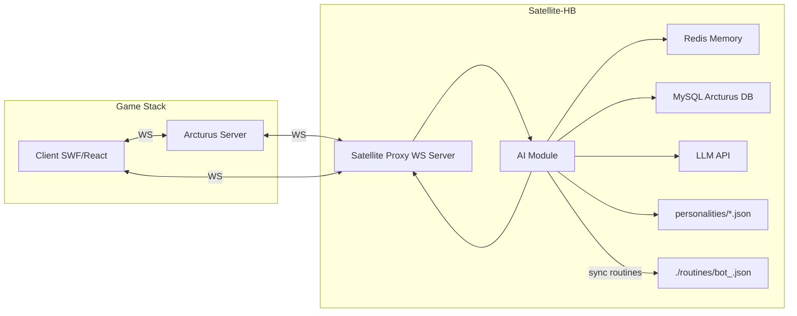
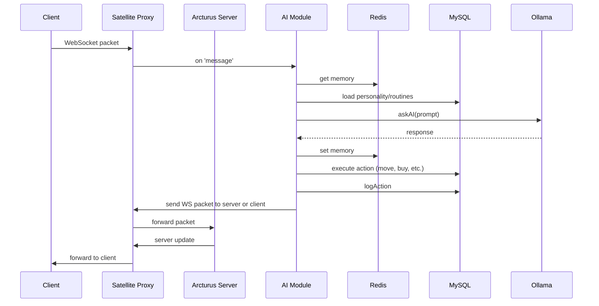
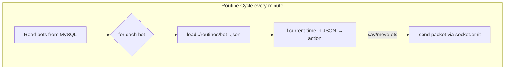

# SATELLITE-HB PAI-OS Brainer
**THIS VERSION WAS DESIGNED TO WORK WITH WS: , BUT I ENDED UP USING WSS:**
**HENCE IT WILL BE DISCONTINUED DEVELOPMENT OF THIS SATELLITE**
**NEW ONE IS ON PROCESS TO USE WSS: AND A CLIENT FOR NITRO**

A fully self-contained “satellite” module sitting between the Arcturus game server and the client, driving AI-powered bot behavior, memory, routines, and world interaction—all in one.

---

## Table of Contents

1. [Overview](#overview)
2. [Features](#features)
3. [Architecture & Data Flow](#architecture--data-flow)
4. [Installation](#installation)
5. [Configuration](#configuration)
6. [Directory Structure](#directory-structure)
7. [How It Works](#how-it-works)

   * [1. Interception & Relay](#1-interception--relay)
   * [2. Message Parsing](#2-message-parsing)
   * [3. Memory & Personality](#3-memory--personality)
   * [4. Routine Sync](#4-routine-sync)
   * [5. AI Prompt & Response](#5-ai-prompt--response)
   * [6. Action Execution](#6-action-execution)
8. [Mermaid Flowcharts](#mermaid-flowcharts)
9. [Extending & Customizing](#extending--customizing)
10. [License & Attribution](#license--attribution)

---

## Overview

**SATELLITE-HB PAI-OS Brainer** is a Node.js service that:

* **Proxies** the game WebSocket
* **Intercepts** packets to and from the client
* **Maintains** long-term & short-term memory in Redis
* **Loads** per-bot personalities (with routines) from JSON
* **Generates** AI prompts via Ollama LLM
* **Executes** in-game actions (move, buy, chat, place items, set emotion, etc.)
* **Synchronizes** scheduled routines automatically

All logic lives in one `satellite-hb.js` file and a `personalities/` folder containing JSON profiles.

---

## Features

* **Zero-touch routine management**: routines defined in personality JSON are auto-exported
* **Persistent memory**: Redis stores each bot’s conversation history
* **Full autonomy**: bots decide when to speak, move, trade, build, and rest
* **World context awareness**: bots know room occupancy & visible items
* **Seamless proxy**: no client-side patching required
* **Easy personalization**: update `bot_<id>.json` to adjust tone, interests, and schedule

---

## Architecture & Data Flow



* **Client** connects to Satellite’s WebSocket on `ws://localhost:8080`.
* **Satellite** forwards traffic to real server at `ws://localhost:3000`.
* **AI Module** sits in the `message` event, processing each chat packet.
* **Redis** holds conversation memory per user.
* **MySQL** reads/writes bot state, positions, inventory, logs.
* **LLM** generates responses and action commands.
* **FS** personality JSON both drives AI and feeds the routine sync.

---

## Installation

1. **Clone** this repo

   ```bash
   git clone https://github.com/MaliosDark/satellite-hb.git
   cd satellite-hb
   ```
2. **Install** dependencies:

   ```bash
   npm install ws redis mysql2 axios
   ```
3. **Ensure** Redis & MySQL are running & configured.
4. **Populate** `personalities/` with `bot_<id>.json` profiles.
5. **Run**:

   ```bash
   node satellite-hb.js
   ```

---

## Configuration

Edit the top of `satellite-hb.js`:

```js
const WS_URL     = 'ws://localhost:3000';      // real Arcturus server
const PROXY_PORT = 8080;                       // satellite listens here
const REDIS_URL  = 'redis://127.0.0.1:6379';
const MYSQL_CFG  = { host:'',user:'',pass:'',database:'' };
const OLLAMA_URL = 'http://localhost:11434/api/generate';
```

---

## Directory Structure

```
SATELLITE-HB/
├─ satellite-hb.js          # main module
├─ package.json
├─ personalities/           # bot_<id>.json profiles
│   ├─ bot_1.json
│   └─ bot_2.json
└─ routines/                # auto-generated by loadPersonality()
    ├─ bot_1.json
    └─ bot_2.json
```

---

## How It Works

### 1. Interception & Relay

* Satellite spins up a WebSocket server on `PROXY_PORT`.
* Injects itself as system proxy for SWF config.
* All client <> server messages flow through here.

### 2. Message Parsing

* On each packet, we `extractMessage()` & `extractUserId()`.
* Skip non-chat or heartbeat packets.

### 3. Memory & Personality

* Load or create bot entry via `getOrCreateBotId()`.
* Fetch conversation memory from Redis.
* Load `bot_<id>.json` to obtain profile & routines.

### 4. Routine Sync

* In `loadPersonality()`, if profile has `"routines"`, we write them to `./routines/bot_<id>.json` so the scheduler can read them.

### 5. AI Prompt & Response

* Build prompt with profile, memory, context.
* Send to Ollama LLM.
* Append response back into Redis memory.

### 6. Action Execution

* Parse LLM output for commands (buy, place, move, trade, mission, emotion).
* Execute DB writes or WebSocket sends accordingly.
* Log every interaction to `ia_logs` table.

---

## Mermaid Flowcharts

### Overall Packet Flow



### Routine Scheduler



---

## Extending & Customizing

* **New Actions**: add handlers in `analyzeAndReact()`.
* **Custom LLM Models**: swap `model` param in `askAI()`.
* **Extra Context**: augment `getRoomContext()` with additional SQL queries.
* **Multi-server**: add clustering around WebSocket server.

---

## License & Attribution

Powered by **Nexus Erebus** research—“prototype for synthetic societies.”
Based on **Arcturus Morningstar** emulator and **Habbo** assets (Sulake™).
LLM integration courtesy of **Ollama**.
© 2025 Nexus Erebus, All Rights Reserved.

